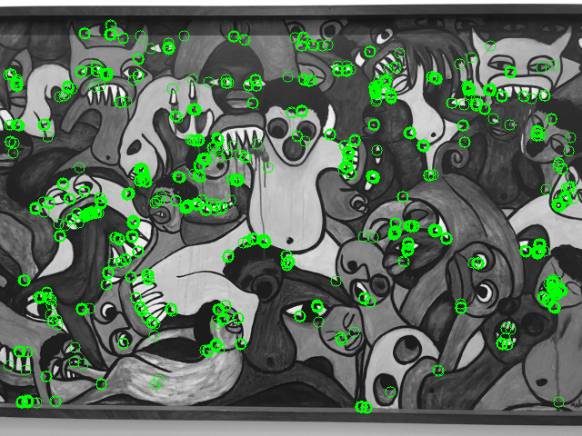
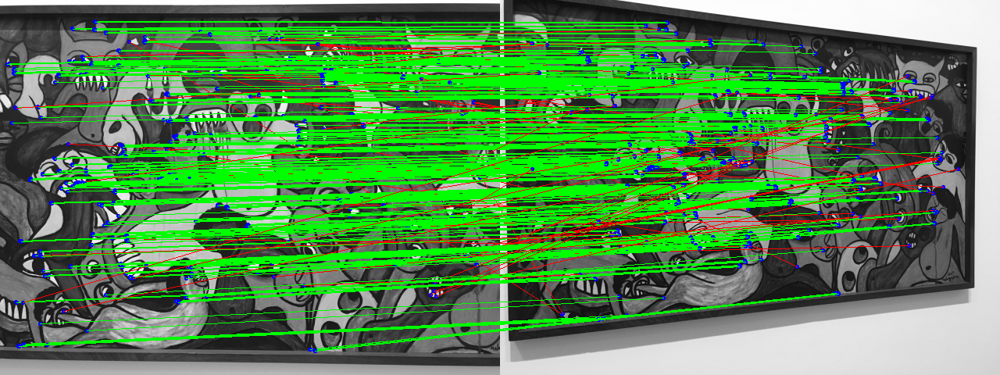
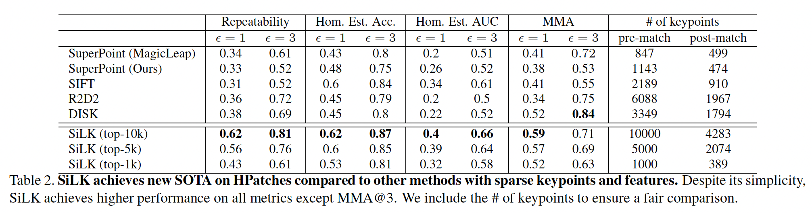
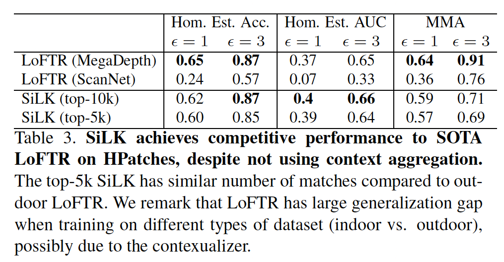
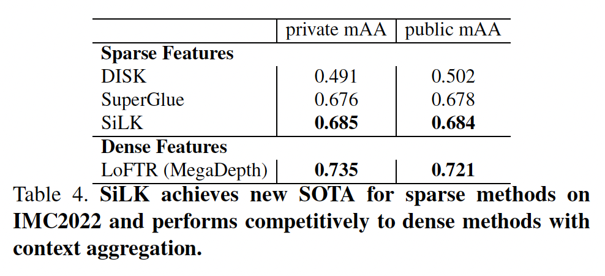
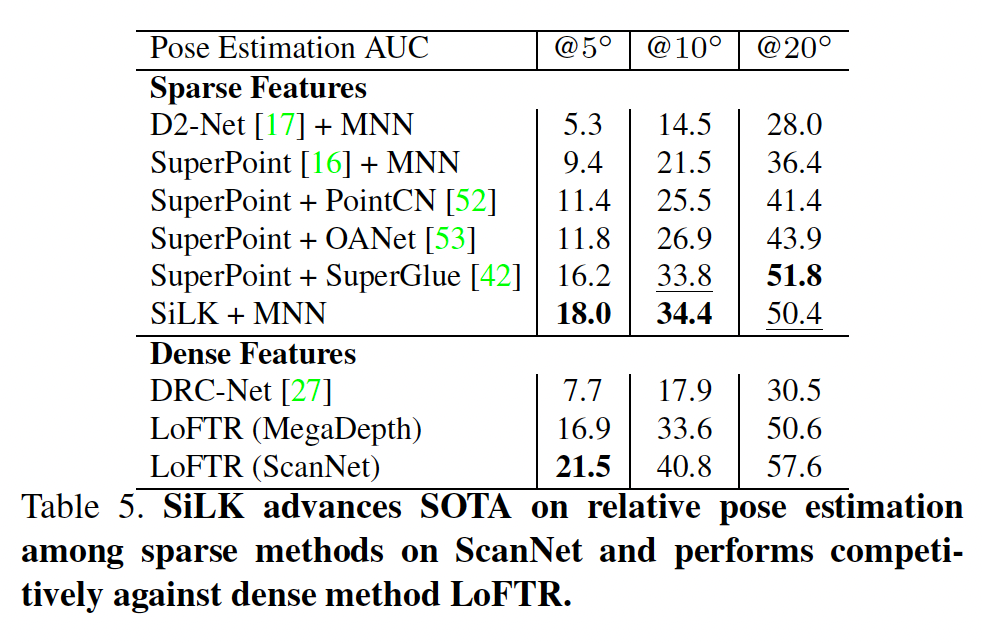
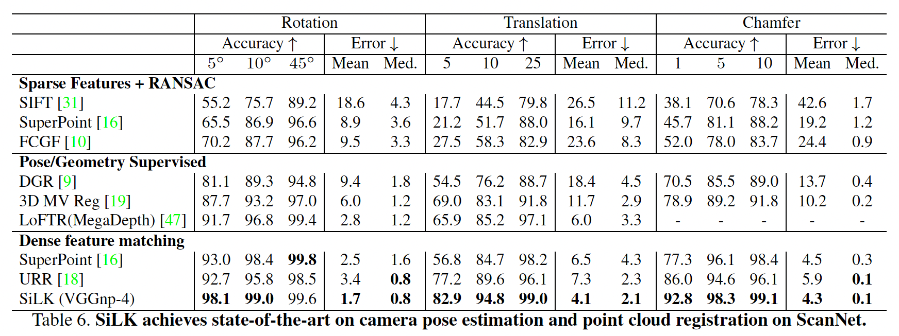

# SiLK - Simple Learned Keypoints

> [[Arxiv Paper](https://arxiv.org/abs/2304.06194)]  
> Authors : [Pierre Gleize](https://gleize.github.io/index.html), [Weiyao Wang](https://sites.google.com/view/weiyaowang/home) and [Matt Feiszli](https://scholar.google.com/citations?user=A-wA73gAAAAJ&hl=en&oi=sra)  
> Conference : ICCV 2023

SiLK is a self-supervised framework for learning keypoints. SiLK focuses on *simplicity* and *flexibility*, while also providing state-of-art and competitive results on existing benchmarks.

  
  

Pre-trained models are also provided.

The released code has been tested on Linux, with two Tesla V100-SXM2 GPUs and takes about 5 hours to train.

## Requirements
* [conda](https://www.anaconda.com/) should be installed in order to setup the silk environment.
* __Two__ GPUs are required to train SiLK.

## Usage

* [How to setup the python environment ?](doc/usage/setup.md)
* [How to setup datasets ?](doc/usage/dataset.md)
* [How to train SiLK ?](doc/usage/train.md)
* [How to add a backbone ?](doc/usage/backbone.md)
* [How to run the evaluation pipeline ?](doc/usage/evaluation.md)
* [How to run inference ?](doc/usage/inference.md)
* [How to convert SiLK to torch script ?](doc/usage/torch_script.md)
* [How to import SiLK features to COLMAP ?](doc/usage/colmap.md)
* [FAQ](doc/usage/faq.md)

## Results

The results below have been computed using our VGG-4 backbone (checkpoint [pvgg-4.ckpt](https://dl.fbaipublicfiles.com/silk/assets/models/silk/analysis/alpha/pvgg-4.ckpt) for tab 2,3,6 and [coco-rgb-aug](https://dl.fbaipublicfiles.com/silk/assets/models/silk/coco-rgb-aug.ckpt) for tab 4,5). To reproduce the [IMC2022](https://www.kaggle.com/competitions/image-matching-challenge-2022) results, we also provide the [Kaggle notebook](https://www.kaggle.com/code/piezzo/imc2022-submission-silk/notebook).

  
  

    
    

## Full Documentation

We provide a documentation, but it is non-exhaustive. Please create a new issue if clarification is required regarding some part of the code. We will add documentation if required by the community.

Our documentation can be found [here](doc/silk/index.html).

## Contributions

See the [CONTRIBUTING](CONTRIBUTING.md) file for how to help out.

## License
**SiLK** is licensed under a *GNU General Public License (Version 3)*, as specified in the [LICENSE](LICENSE) file.
